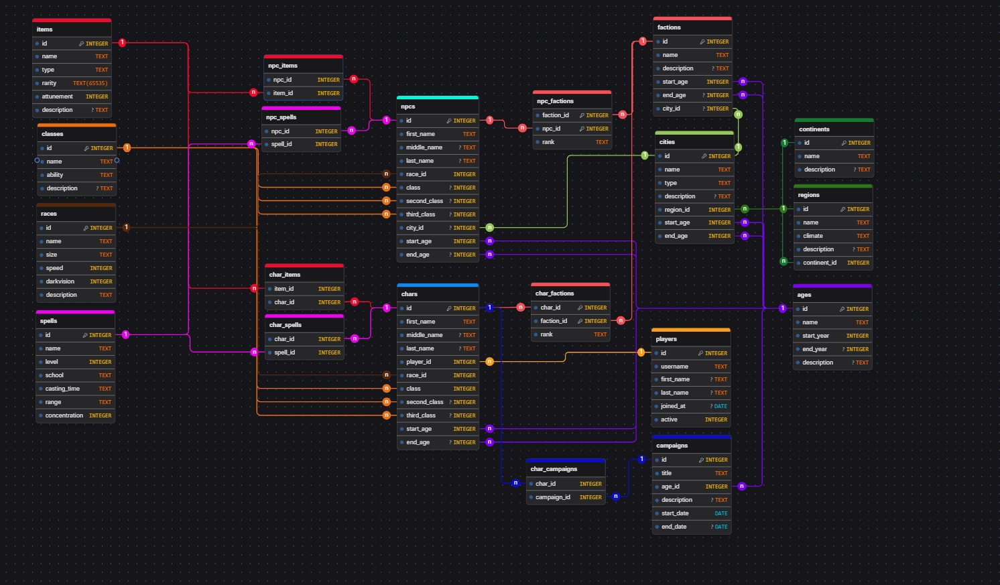

# Design Document - MY RPG WORLD

By João Victor da Cunha Salvador

Video overview: <URL HERE>

## Terminology Disclaimer

Throughout this document and schema design, several terms derived from fifth-edition Dungeons & Dragons (D&D 5e) and general tabletop role-playing games (TTRPGs) are used to categorize game mechanics and narrative elements. For clarity, PC refers to Player Characters (entities controlled by human players), while NPC denotes Non-Player Characters (world entities managed by the Dungeon Master). Terms such as Cantrips (level 0 spells), Concentration (a spell property requiring active focus), School of Magic (magical taxonomies like Evocation or Abjuration), Attunement (a mechanic limiting active magic item usage), and Multiclassing (combining multiple character classes) represent standard mechanics used to structure entities, constraints, and analytical views within the database.

## Scope

My RPG World is a database designed to store and manage data related to tabletop RPG campaigns set within a custom-built Dungeons and Dragons universe. The primary goal of this database is to track players and the characters they played across different campaigns, as well as the specific era of the universe in which each campaign takes place and each character exists.

The database records full profile tracking for both player characters and non-playable characters, including full name breakdowns, multiclassing support for up to three classes, race associations, home or current city locations, and their active timeline defined by start and end ages. It also tracks factions within the universe, their historical lifespans, and many-to-many relationships that link characters and NPCs to these organizations along with their specific rank.

Magical capabilities and equipment are managed through cataloged spells with attributes like level, school, casting time, range, and concentration, as well as magic items detailing rarity, type, and attunement status. These are connected to both characters and NPCs through dedicated junction tables. The world design follows a hierarchical location model connecting cities to regions and regions to continents. Chronology and campaigns are maintained through a structured timeline of historical eras linked to cities, factions, NPCs, characters, and campaigns, which also track campaign titles, descriptions, timelines, and the Dungeon Master running them.

To keep the database focused and efficient, general mechanics and mundane inventory such as non-magical equipment, ropes, torches, basic rations, and monetary transactions are explicitly excluded. Combat tracking such as real-time initiative, turn-by-turn battle logs, hit point changes, and spell slot consumption per encounter are also outside the scope. Rulebook data beyond core elements, including detailed subclass feature trees and full monster stat blocks, are excluded in favor of basic NPC profiles.

The main objective is to enable comprehensive analytical queries and views that allow a Dungeon Master to retrieve all relevant summary information for any given character, city, NPC, faction, or era within the universe in a single call.

## Functional Requirements

A user of the My RPG World database should be able to query complete profiles for player characters and non-playable characters, including their full names, race, primary and subsequent classes for multiclassed characters, and historical era timeline. The database allows users to retrieve character and NPC inventories, tracking all magic items owned and spells known by each individual. Users can track players across multiple campaigns by linking players to the specific characters they have played in various games, as well as view faction memberships detailing which characters or NPCs belong to specific organizations and their given rank within those factions. Furthermore, users can explore geographic and temporal hierarchies by querying which cities belong to specific regions, which regions belong to continents, and which eras define the lifespan of cities, factions, campaigns, and characters. The system enables executing analytical views and complex joins to summarize world lore and campaign states for a Dungeon Master in a single query.
Beyond the scope of what a user should be able to do with the database includes managing real-time combat mechanics, such as tracking hit points, initiative order, round-by-round action logs, or temporary status conditions during encounters. Cataloging non-magical inventory and mundane gear, including basic supplies, torches, ropes, arrows, or currency and wallet balances, is explicitly excluded. The database is not intended to track active spell slot consumption, daily resource usage, or temporary buff and debuff durations per session. Finally, storing full Dungeons and Dragons rulebook material, including comprehensive subclass feature progression trees, full spell descriptions, or complete monster stat blocks beyond core character attributes, remains outside the scope of user capabilities.

## Representation

### Entities

The database represents core entities divided into world mechanics, geography, organizations, campaigns, and characters. The ages entity stores historical eras using an integer primary key, a unique text name, start and end years as integers (because it uses a fantastic system of counting years), and a text description. Geography is structured through continents, regions, and cities. Continents store a primary key, a unique text name, and a text description. Regions reference a continent through an integer foreign key and store a unique name, climate type as text, and description. Cities links to regions and ages via integer foreign keys and record a unique name, settlement type text, and description. Campaigns track campaign titles, descriptions, and start and end dates, linked to historical ages through foreign keys, while players store users profiles with a unique username, full name text fields, a registration date, and an active status flag.

RPG mechanics use items, spells, classes, and races as catalog entities. Items store a unique name, type, rarity, an attunement flag, and a text description. Spells record a unique name, spell level as an integer, school, casting time, range, a concentration flag, and description text. Classes define character DND classes using a unique name, a primary ability score abbreviation, and a description, while races store a unique name, size category, movement speed integer, darkvision flag, and description text. Factions capture in-universe organizations with a unique name, description, founding and disbanding ages, and an optional home city foreign key. Characters and non-playable characters form the primary actors, storing full name fields, race foreign keys, up to three class foreign keys to support multiclassing, home city references, and active age lifespans. Player characters additionally link to a player foreign key, while non-playable characters allow optional class assignments. Many-to-many associations for items, spells, factions, and campaign participations are resolved using dedicated junction tables storing pair-wise integer foreign keys and contextual attributes like faction ranks.

Data types were chosen to reflect the nature of DND RPG attributes accurately while optimizing SQLite storage efficiency. Integer types are assigned to all primary keys, foreign keys, numeric measurements like movement speed, spell levels, and calendar years to allow efficient indexing, fast joins, and range filtering. Text fields are used for names, categories, descriptions, and dates. Boolean flags such as attunement, concentration, darkvision, and player active status are stored as integers using zero and one representations.

Constraints were applied throughout the schema to enforce domain rules and preserve referential integrity across the database. Primary keys uniquely identify every record, while foreign keys strictly enforce valid connections between dependent entities, such as ensuring a character references an existing race, class, or player. Unique constraints prevent duplicate entries for entity names like spells, items, factions, races, and usernames. Check constraints restrict integer flags to zero or one, limit spell levels to valid ranges between zero and nine, and validate ability score strings to recognized standard primary attributes. Cascade deletion rules are applied to junction tables so that removing a character or NPC automatically cleans up associated inventory, spellbook, and faction records without leaving orphaned data or violating relational rules.

### Relationships

## Optimizations

The database uses indexes and views to speed up queries and simplify complex data retrieval. Indexes were created on character and non-playable character names, player links, geographic locations, and starting ages for world entities. Dedicated indexes were also added to junction tables for spells, items, and campaign enrollments to ensure fast join operations.

Views simplify complex join logic for common Dungeon Master tasks. The character sheet and non-playable character sheet views group character traits, classes, locations, eras, and faction memberships into a single row per entity. The world atlas view organizes cities, regions, climates, continents, and founding eras into a clear geographical layout. Finally, combined list views for spells and inventories merge player character and non-playable character records into single tables for quick reference.

## Limitations

While the database design effectively handles core worldbuilding and campaign management entities, several limitations exist due to the chosen relational constraints and schema boundaries. First, the static three-class limit in the characters and non-playable characters entities restricts endless multiclassing, which may not fully support homebrew rules or edge-case builds that span four or more classes. Second, storing historical timelines using single age references simplifies temporal queries but lacks exact numeric date or calendar tracking, making it difficult to record precise days, months, or overlapping chronological timelines within a single era.

Additionally, the schema does not natively represent dynamic mechanical state changes that occur during active tabletop gameplay. Temporary conditions, hit point fluctuations, spell slot consumption, dynamic inventory weight tracking, and spatial combat grids are intentionally omitted to maintain focus on macro-level world state rather than live session orchestration. Finally, while faction memberships support assigned rank titles, the database does not model complex political relationships or diplomatic alignments—such as wars, truces, or rivalries—directly between two distinct factions without introducing custom junction schemas.
