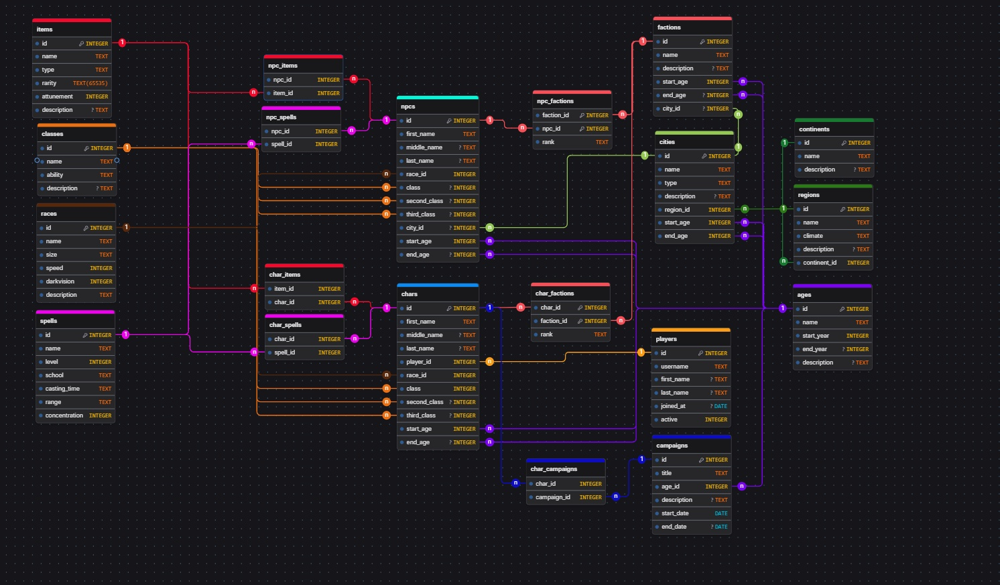

# ⚔️ My RPG World – Database Design (CS50 SQL Final Project)

This repository contains the database schema, queries, documentation, and ER diagram for **My RPG World**, a relational database designed to power a tabletop/online Role-Playing Game (RPG) system. 

This project serves as the final project for Harvard University's **CS50’s Introduction to Databases with SQL** (offered via edX).

---

## 📌 Overview

**My RPG World** models a rich fantasy universe, handling entities such as players, characters, classes, items, equipment, inventory management, quests, and battle logs. 

The primary goal is to ensure high data integrity, eliminate redundancy through normalization, and optimize frequent queries for real-time game mechanics.

---

## 📂 Repository Contents

- [`schema.sql`](./schema.sql): DDL statements creating all core tables, constraints, foreign keys, views, and indexes.
- [`queries.sql`](./queries.sql): Common SQL operations used by the application (e.g., character creation, equipping items, quest progress, leaderboards).
- [`DESIGN.md`](./DESIGN.md): Detailed architectural documentation outlining the scope, entity design, relationships, and performance considerations.
- [`diagram.jpeg`](./diagram.jpeg): Entity-Relationship (ER) diagram illustrating the database layout.

---

## 🗺️ Entity-Relationship Diagram

---

## 🛠️ Database Schema Highlights

- **Players & Characters:** One-to-Many relationship allowing players to create multiple characters.
- **Classes & Stats:** Predefined character classes with base attributes and level progression.
- **Inventory System:** Many-to-Many relationship between characters and items with quantity tracking.
- **Quests & Progression:** Tracks character quest status, objectives, and rewards.
- **Performance Optimization:** Targeted indexes on high-frequency lookup fields (e.g., character levels, item types) and analytical views.

